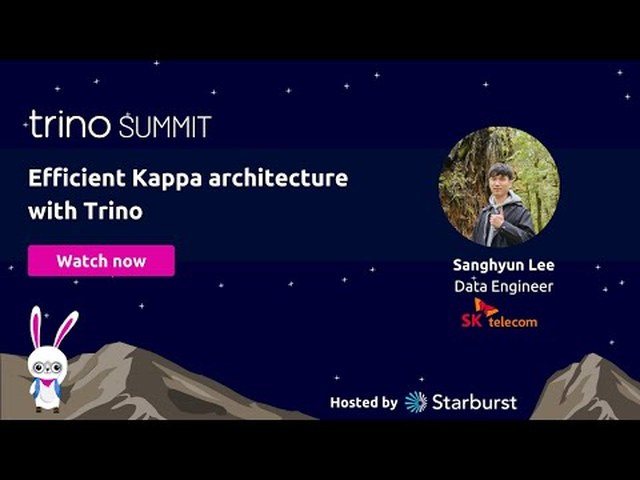

# Sang Hyun Lee

**Data &amp; AI Platform Engineer** &nbsp;·&nbsp; Seoul, Korea

I build the infrastructure that moves data at scale — streaming ingestion, lakehouse storage, 
distributed query engines — and the LLM agents that make it usable. 
Currently at **SK Telecom**, on a petabyte-scale data platform.

---

## What I work on

**⚡ Streaming lakehouse pipelines** 
Kafka → Flink → Iceberg ingestion for high-volume sensor and process data, sustaining roughly 3M records/sec into a petabyte-scale lake. Benchmarked Iceberg against Hudi across insert, upsert, query and maintenance workloads before committing to the table format; built out the Flink Kubernetes Operator deployment, and Spark (Scala) maintenance jobs — compaction, sorting, snapshot expiry — orchestrated on Airflow.

**🔎 Query engine performance** 
A 100+ node Trino cluster fields 300+ queries per minute, individual queries scanning terabytes. Most of the wins came from the storage side — partition strategy, sort order, compaction cadence — and the rest from the query side: pushdown improvements and approximate aggregations where exactness wasn't required. This architecture was the subject of my Trino Summit 2023 talk.

**☸️ Multi-tenant runtime on Kubernetes** 
A self-service platform that provisions per-user Spark and StarRocks clusters on demand, operating thousands of them concurrently: custom operators and CRDs, a Java/Spring orchestration service, Helm packaging, ArgoCD GitOps, and Prometheus/OpenSearch observability. Running an OLAP engine as a multi-tenant service — rather than as one shared cluster — is where most of my engine-internals work comes from.

**🤖 Agents for platform operations** 
An agent that consumes query history and cluster state snapshots off Kafka, diagnoses resource, configuration and query-level problems, and proposes concrete fixes — applied only after human approval. Deterministic rules and cost models do the heavy lifting; the model handles classifying unseen symptoms, correlating signals, and rewriting queries.

**🧠 Domain-expert agents** 
A knowledge-graph-driven agent for operational troubleshooting, structured as *graph selection → graph traversal → path evaluation*: LLM-based graph selection to cover the gaps in vector similarity search, hierarchical filtering over a partitioned graph, parallel sub-agents that traverse branches and prune infeasible paths early, self-correcting tool-call loops, and a final helpfulness/groundedness evaluation that picks or aggregates the answer path. Includes Text-to-SQL over Oracle and Postgres, and on-prem inference tuning with vLLM (speculative decoding, prefix caching).

**🎯 Domain-specialized LLM** 
Fine-tuned SK Telecom's A.X foundation model (32B) with DeepSpeed and TRL into an HR-domain assistant, reaching ~90% of the then-SOTA general model's quality on evaluations scored by domain experts — at a fraction of the serving cost.

---

## Talks

<table>
<tr>
<td width="50%" valign="top">

<h3>Efficient Kappa Architecture with Trino</h3>
<b>Trino Summit 2023</b>

One pipeline instead of two — serving terabyte-scale queries over data that is still arriving, on Kafka, Flink, Iceberg and Trino.

</td>
<td width="50%" valign="top">

<h3>Building Domain-Expert Agents</h3>
<b>AI Community Conference (AICO) Seoul 2025</b>

Moving an agent from general capability to domain expertise — knowledge graphs over flat retrieval, traversal with early pruning, and grading the path rather than only the answer.

</td>
</tr>
</table>

---

## Open source

Fixes to the query engines, catalogs and operators we run in production.

| Project | Merged PR | Area | Fix |
| --- | --- | --- | --- |
| Apache Polaris | [#5247](https://github.com/apache/polaris/pull/5247) | Auth | Turn a transient metastore outage during authentication into a retryable 503 rather than a permanent 500 |
| Apache Polaris | [#5363](https://github.com/apache/polaris/pull/5363) | Auth | Return one generic 503 so an unauthenticated caller cannot tell which internal lookup failed |
| Apache Polaris | [#5361](https://github.com/apache/polaris/pull/5361) | Persistence | Add the missing grant index to the CockroachDB schema, so permission checks stop scanning every grant in the realm |
| StarRocks | [#78722](https://github.com/StarRocks/starrocks/pull/78722) | Query execution | Clamp UTF-8 character stepping to the value's own bytes, stopping an out-of-bounds read that returned other rows' data |
| StarRocks | [#79037](https://github.com/StarRocks/starrocks/pull/79037) | Query execution | Return 0 from months_diff and years_diff for two dates in the same month or year, instead of -1 |

---

## Experience

<table>
<tr><td><b>2023 — present</b></td><td><b>SK Telecom</b> Data Platform</td><td>Streaming lakehouse at petabyte scale · query runtime as a multi-tenant Kubernetes service · LLM agents and domain fine-tuning</td></tr>
<tr><td><b>2022 — 2023</b></td><td><b>KFTC</b> Korea Financial Telecommunications &amp; Clearings Institute · Data Analytics</td><td>Real-time fraud detection on open banking traffic, peaks of 500K TPS · batch ETL landing hundreds of millions of rows across thousands of tables daily · nationwide ATM and branch data service spanning 38 institutions</td></tr>
<tr><td><b>2019 — 2021</b></td><td><b>Samsung Research</b> Data Analytics Lab</td><td>Household clustering over 100M+ device logs — graph construction, Louvain clustering, day-over-day cluster tracking. Rebuilt a single-node pipeline on Spark: 2 hours → 30 minutes</td></tr>
</table>

B.S. in Information Systems, Hanyang University

---

## Tech

<table>
<tr><td valign="top"><b>Streaming &amp; batch</b></td><td>   </td></tr>
<tr><td valign="top"><b>Lakehouse &amp; query</b></td><td>       </td></tr>
<tr><td valign="top"><b>AI &amp; LLM</b></td><td>   </td></tr>
<tr><td valign="top"><b>Platform</b></td><td>      </td></tr>
<tr><td valign="top"><b>Languages</b></td><td>    </td></tr>
</table>

---

[LinkedIn](https://www.linkedin.com/in/sanghyun-lee-7b9b6a236) &nbsp;·&nbsp; [shyundev@gmail.com](mailto:shyundev@gmail.com) &nbsp;·&nbsp; [shyun9417@sk.com](mailto:shyun9417@sk.com) &nbsp;·&nbsp; earlier work, archived at [github.com/sahyle9417](https://github.com/sahyle9417) and [gitlab.com/sahyle9417](https://gitlab.com/sahyle9417)

